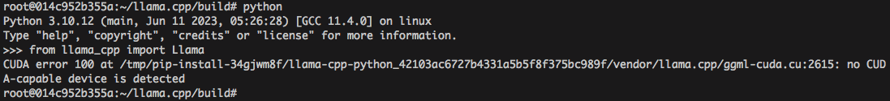

# [llama.cpp](https://github.com/ggerganov/llama.cpp) build with CUDA on Ubuntu

[Georgi Gerganov]() llama.cpp's main objective is to run the model using 4-bit quantization on a MacBook or personal laptops. 4-bit quantization is a technique for reducing the size of models so they can run on less powerful hardware. It also reduces the model sizes on disk—to 4GB for the 7B model and just under 8GB for the 13B one.

The below content give ste-by-step approach to make the CUDA enabled phython wheel for llama.cpp, currently i am running them inside a docker container. 

## Steps to get the CUDA enabled python wheel for llama:

**STEP 1**: Create the ubuntu 22.04 images using following command:

`docker pull ubuntu:20.04`  

**STEP 2**: Once the images is pulled, create a container using following command:

`docker run -it <image_name> bash`

Press Clt P Q - to come out of container

Re-enter using following command:

`docker exec -it <container_name> bash`

**STEP 3**: Requirement gathering:

```
$ apt-get -y update -qq && apt-get -y upgrade

$ apt-get -y install wget unzip build-essential pkg-config cmake git python3 python-is-python3 python3-pip python3.10-venv

$ cd

$ git clone https://github.com/ggerganov/llama.cpp

$ cat /etc/lsb-release → To verify the OS and its version, so that we can download the require CUDA toolkit
```

**STEP 4**: Got the CUDA details from following webpage: https://developer.nvidia.com/cuda-downloads?target_os=Linux
```
$ mv cuda-ubuntu2204.pin /etc/apt/preferences.d/cuda-repository-pin-600

$ wget https://developer.download.nvidia.com/compute/cuda/12.2.1/local_installers/cuda-repo-ubuntu2204-12-2-local_12.2.1-535.86.10-1_amd64.deb

$ dpkg -i cuda-repo-ubuntu2204–12–2-local_12.2.1–535.86.10–1_amd64.deb

$ cp /var/cuda-repo-ubuntu2204–12–2-local/cuda-*-keyring.gpg /usr/share/keyrings/

$ apt-get update

$ apt-get -y install cuda
```

You will notice something like this and MUST reboot the box:
*****************************************************************************
*** Reboot your computer and verify that the NVIDIA graphics driver can ***
*** be loaded. ***
*****************************************************************************

**STEP 5**: Cross compile llama.cpp with CUDA
```
$ cd llama.cpp/

$ mkdir build

$ cd build

$ cmake .. -DLLAMA_CUBLAS=ON -DCMAKE_CUDA_COMPILER:PATH=/usr/local/cuda-12.2/bin/nvcc
NOTE: it is important to specify the UDA compiler path if its not in the rootfs. Another option is to add it to the PATH. My best option is to give as an argument to CMAKE.

$ readelf -d bin/main >>> To verify this is indeed a CUDA compile ELF file.
```
**STEP 6**: Time to make the python wheel
```
$ CMAKE_ARGS="-DLLAMA_CUBLAS=on -DCMAKE_CUDA_COMPILER:PATH=/usr/local/cuda-12.2/bin/nvcc" FORCE_CMAKE=1 pip install llama-cpp-python
```

**STEP 7**: You must see the CUDA python version (testing)



In reality you should not see the above error message, it's because i do not have CUDA-GPU on my matching. 


## Next step is to have a Dockerfile to spawn the container directly. 
